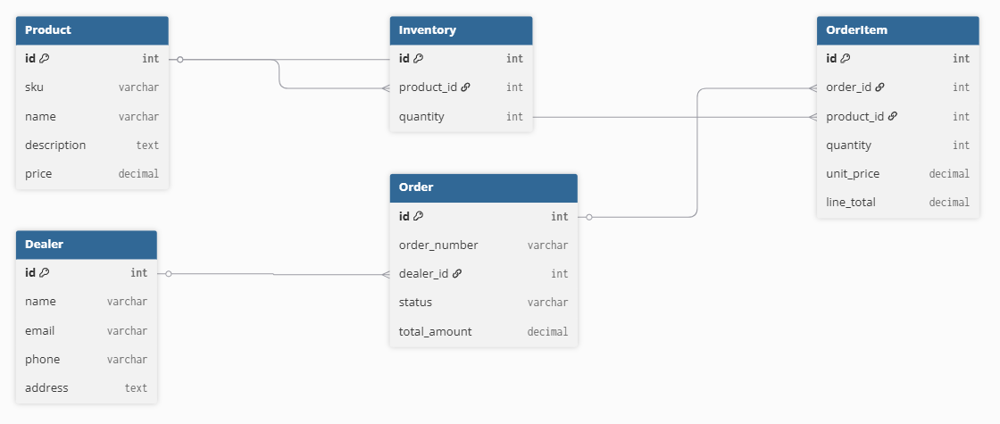

# Sales Order & Inventory Lite
## 📌 Project Overview

This project is a simplified Sales Order & Inventory Management System built using Django and Django REST Framework.

It simulates core backend functionality of a B2B auto parts distribution platform, focusing on:

- Product catalog management
- Inventory tracking
- Dealer management
- Sales order lifecycle
- Stock validation & atomic deduction
- Strict order status transitions

The implementation prioritizes clean database design, business logic correctness, and maintainable code structure.

---

## 🛠 Tech Stack

- Python 3.10+
- Django 4.x
- Django REST Framework
- SQLite (default Django database)

---

## Project Structure
```
sales_inventory/  ← root folder in repo
├── manage.py
├── README.md
├── requirements.txt
├── docs/
│   └── DB_Schema.png
├── sales_inventory_postman_collection.json
├── sales_inventory/  ← Django project
│   ├── settings.py
│   ├── urls.py
│   └── wsgi.py
└── core/  ← Django app
    ├── models.py
    ├── views.py
    ├── serializers.py
    └── urls.py
```

---

## 🧠 Database Design

### Models Implemented

1. Product
2. Inventory (One-to-One with Product)
3. Dealer
4. Order
5. OrderItem

### Key Design Decisions

- SKU is unique and indexed
- Each Product has exactly one Inventory record
- Dealer → Multiple Orders
- Order → Multiple OrderItems
- OrderItems store unit_price to preserve price history
- Order numbers auto-generated in format:
  
  `ORD-YYYYMMDD-XXXX`

- Confirmed and Delivered orders are immutable
- Stock deduction happens only on Draft → Confirmed
- Atomic transactions prevent race conditions

---

## Database Schema


---

## 🔄 Order Status Flow

Orders follow strict transitions:

Draft → Confirmed → Delivered

Invalid transitions are rejected.

---

## 📦 Business Rules Implemented

### 1. Stock Validation
- All order items validated before confirmation
- If any product has insufficient stock, entire order is rejected
- Clear error messages returned

### 2. Stock Deduction
- Stock deducted only when confirming
- Uses transaction.atomic()
- Uses select_for_update() for row locking

### 3. Order Editing Rules
- Draft orders: editable
- Confirmed/Delivered: immutable
- Attempted edits return validation errors

### 4. Auto Calculations
- line_total = quantity × unit_price
- total_amount = sum of line_totals

---

## 🚀 Setup Instructions

### 1️⃣ Clone Repository

```bash
git clone https://github.com/SyedZubairYousuff/sales_inventory.git
cd sales_inventory
```

### 2️⃣ Create Virtual Environment

```
python -m venv venv
source venv/bin/activate  # Mac/Linux
# venv\Scripts\activate   # Windows
```

3️⃣ Install Dependencies
```
pip install -r requirements.txt
```

4️⃣ Run Migrations
```
python manage.py makemigrations
python manage.py migrate
```

5️⃣ Run Server
```
python manage.py runserver
```

Server runs at:
```
http://127.0.0.1:8000/
```
---

## API Endpoints
### Products
| Method | Endpoint            | Description    |
| ------ | ------------------- | -------------- |
| GET    | /api/products/      | List products  |
| POST   | /api/products/      | Create product |
| GET    | /api/products/{id}/ | Product detail |
| PUT    | /api/products/{id}/ | Update product |
| DELETE | /api/products/{id}/ | Delete product |

### Dealers
| Method | Endpoint           |
| ------ | ------------------ |
| GET    | /api/dealers/      |
| POST   | /api/dealers/      |
| GET    | /api/dealers/{id}/ |
| PUT    | /api/dealers/{id}/ |

### Orders
| Method | Endpoint                  |
| ------ | ------------------------- |
| GET    | /api/orders/              |
| POST   | /api/orders/              |
| PUT    | /api/orders/{id}/         |
| POST   | /api/orders/{id}/confirm/ |
| POST   | /api/orders/{id}/deliver/ |

### Inventory (Admin Only)
| Method | Endpoint             |
| ------ | -------------------- |
| GET    | /api/inventory/      |
| PUT    | /api/inventory/{id}/ |
---

## 📬 API Testing (Postman Collection)

This repository includes a Postman collection file:

`sales_inventory_postman_collection.json`

Import the collection into Postman to test all available endpoints, including:
- Products
- Dealers
- Orders
- Inventory (Admin only)

The APIs are ready to run on:
http://127.0.0.1:8000/api/
---

## 🧪 Sample Test Flow

1. Create Product (Brake Pad – ₹500)
1. Add Inventory (100 units)
1. Create Dealer
1. Create Draft Order (10 units)
1. Confirm Order → Stock reduces to 90
1. Deliver Order → Status updated

## ⚠️ Error Scenarios Handled

* Insufficient stock validation
* Invalid status transitions
* Editing confirmed/delivered orders
* Confirming empty orders

## 🔐 Assumptions

* Inventory must exist before confirming order
* Draft orders do not reserve stock
* Inventory adjustments do not retroactively modify past orders

## 🔐 Access Control

- Inventory updates are restricted to Admin users only.
- Stock adjustments are allowed only through the Inventory endpoint.
- Order confirmation automatically deducts stock.
- Confirmed and Delivered orders cannot be modified.

# 👨‍💻 Author
## Syed Zubair Yousuff
